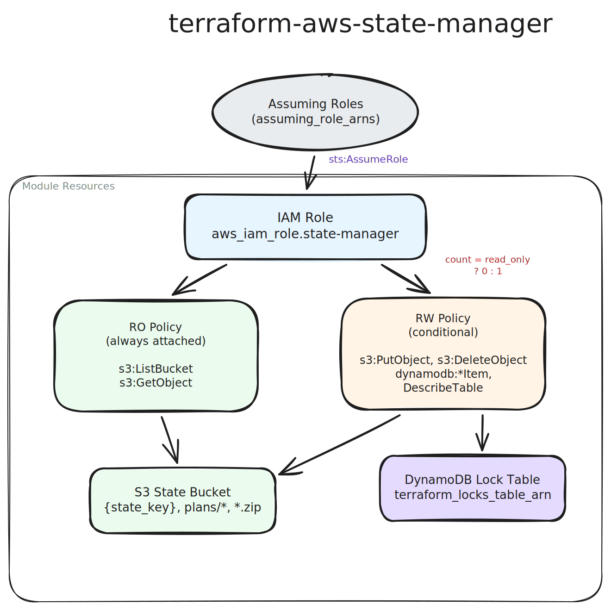

# Architecture



## Overview

The module creates an IAM role with two permission policies — one for read-only S3
access and one for read-write S3 and DynamoDB access. The read-write policy attachment
is conditional on the `read_only_permissions` variable.

## Resources Created

```
                     ┌─────────────────────────┐
                     │    IAM Role             │
                     │    (state-manager)       │
                     │                         │
                     │  Trust Policy:           │
                     │  assuming_role_arns      │
                     └────────┬────────────────┘
                              │
                 ┌────────────┴────────────┐
                 │                         │
        ┌────────▼────────┐      ┌────────▼────────┐
        │  RO Policy      │      │  RW Policy      │
        │  (always        │      │  (attached only  │
        │   attached)     │      │   when           │
        │                 │      │   read_only=     │
        │  s3:ListBucket  │      │   false)         │
        │  s3:GetObject   │      │                  │
        │                 │      │  s3:PutObject    │
        └─────────────────┘      │  s3:DeleteObject │
                                 │  dynamodb:*Item  │
                                 │  dynamodb:       │
                                 │  DescribeTable   │
                                 └──────────────────┘
```

## Permission Modes

### Read-Write (default)

Both policies are attached. The role can:

- **S3**: List the state bucket, read/write/delete state files, plan artifacts
  (`plans/*`), and zip files (`*.zip`)
- **DynamoDB**: Acquire and release state locks (`GetItem`, `PutItem`, `DeleteItem`,
  `DescribeTable`)

This mode is used for roles that run `terraform plan` and `terraform apply`.

### Read-Only (`read_only_permissions = true`)

Only the RO policy is attached. The role can:

- **S3**: List the state bucket and read state files and artifacts
- **DynamoDB**: No access

This mode is used for roles that only access state via the `terraform_remote_state`
data source. Note that `terraform plan` requires DynamoDB lock access and will not
work with a read-only role.

## S3 Resource Scope

The policies grant access to three S3 paths within the state bucket:

| Path | Purpose |
|------|---------|
| `{state_key}` | The Terraform state file itself |
| `plans/*` | Plan artifacts stored in the bucket |
| `*.zip` | Zipped state or plan archives |

## Trust Policy

The role's assume-role trust policy allows only the IAM principals specified
in `assuming_role_arns`. No wildcard principals, external IDs, or MFA conditions
are configured — this is designed for service-to-service role assumption
(e.g., GitHub Actions assuming the state manager role).

## Name Truncation

AWS IAM role names have a 64-character limit. The module uses
`substr(var.name, 0, 64)` to automatically truncate names that exceed this limit.
The actual role name is available in the `state_manager_role_name` output.
